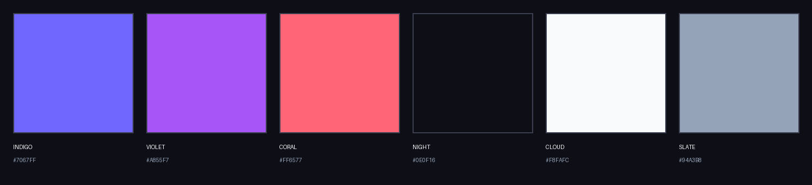

<picture>
  <source media="(prefers-color-scheme: dark)" srcset="docs/assets/brand/readme-banner-dark.png">
  
</picture>

# Modyra

**Model once. Render anywhere.** A framework-agnostic, type-safe form
engine with native bindings for Angular, React, Vue and Lit — one shared
core, one shared headless widget layer, one shared theme package.

- No `FormControl`, `FormGroup` or RxJS — form state is signals and `computed`s
- Compile-time checked field bindings: `[field]="form.f.email"`, typos don't compile
- Sync, async (debounced, cancellable, last-wins) and cross-field validation
- Typed field arrays (`array()`) for repeatable rows — push/insert/remove/move
- Drafts (autosave/restore), undo/redo, devtools
- Headless core or accessible ready-made controls — your design system or ours
- Incremental Angular adoption through Reactive Forms interop (`mdyCva`)

[](https://angular.dev)
[](https://www.typescriptlang.org)
[](LICENSE)
[](https://github.com/sponsors/lorenzomusche)

## Packages

| Package                               | What it is                                                                                                 | Peer deps              |
| :------------------------------------ | :--------------------------------------------------------------------------------------------------------- | :--------------------- |
| [`@modyra/core`](packages/core)       | Framework-agnostic form engine: typed field trees, validation, drafts, undo/redo, i18n/date/time utilities | —                      |
| [`@modyra/widgets`](packages/widgets) | Headless widget controllers + universal interaction/accessibility contract                                 | —                      |
| [`@modyra/angular`](packages/angular) | Angular binding on native signals — the most complete adapter (UI catalog, devtools, wizard, interop)      | `@angular/*` ≥21       |
| [`@modyra/react`](packages/react)     | React binding via `useSyncExternalStore`                                                                   | `react` ≥18            |
| [`@modyra/vue`](packages/vue)         | Vue binding on `@vue/reactivity`                                                                           | `@vue/reactivity` ≥3.4 |
| [`@modyra/lit`](packages/lit)         | Lit binding — ReactiveController + themable form elements                                                  | `lit` ≥3               |
| [`@modyra/zod`](packages/zod)         | Framework-agnostic Zod adapter — schema-first typed forms                                                  | `zod` ≥3.25            |
| [`@modyra/styles`](packages/styles)   | CSS themes (`default`, `material`, `ios`, `ionic`, `base`) for every adapter                               | —                      |

## Install (Angular)

```bash
npm install @modyra/angular
```

Optional theme package (skip if you go headless):

```bash
npm install @modyra/styles
```

```json
"styles": [
  "@modyra/styles/default.css",
  "src/styles.scss"
],
```

## 60-second example

```ts
import { Component } from "@angular/core";
import { field, group, mdyForm } from "@modyra/angular/adapter";
import {
  MdyFormComponent,
  MdyTextComponent,
  MdyNumberComponent,
} from "@modyra/angular/ui";
import {
  email as mdyEmail,
  min as mdyMin,
  required as mdyRequired,
} from "@modyra/core";

@Component({
  selector: "app-signup",
  standalone: true,
  imports: [MdyFormComponent, MdyTextComponent, MdyNumberComponent],
  template: `
    <mdy-form [form]="form" [action]="save">
      <mdy-control-text [field]="form.f.email" label="Email" />
      <mdy-control-number [field]="form.f.age" label="Age" />
      <mdy-control-text [field]="form.f.address.city" label="City" />
      <button type="submit" [disabled]="!form.state.canSubmit()">
        Sign up
      </button>
      <button type="button" (click)="form.reset()">Reset</button>
    </mdy-form>
  `,
})
export class SignupComponent {
  readonly form = mdyForm({
    email: field("", [mdyRequired(), mdyEmail()], {
      // runs after the sync validators pass, debounced while typing
      asyncValidators: [async (v) => (await isTaken(v)) ? ["Email taken"] : []],
      asyncDebounceMs: 300,
    }),
    age: field<number | null>(null, [mdyMin(18)]),
    address: group({ city: field("Rome"), zip: field("") }),
  });

  // Runs on submit while the form is valid; the typed value is inferred:
  // { email: string; age: number | null; address: { city: string; zip: string } }
  save = async (value: Record<string, unknown>) => {
    const res = await api.signup(value);
    if (!res.ok) {
      // returned errors land on the matching field, or the form itself
      // when path is null — canSubmit() flips back to true automatically
      return [{ path: "email", kind: "server", message: "Email already registered" }];
    }
  };
}
```

> **Validators are factories, not values:** write `required()`, not
> `required` (Angular Reactive Forms muscle memory trips here — the
> resulting TS error is easy to misread). Validation errors come back as
> **arrays of message strings** (`["Name taken"]`), not `{ required: true }`
> keyed objects. To stop at the first failing validator instead of collecting
> all of them, use `composeFirst()` in place of `compose()`.

Every handle on `form.f` is a typed bundle of signals — `value()`, `errors()`,
`touched()`, `dirty()`, `valid()`, `pending()`, `set(v)` — and a typo on a
handle path is a **compile error** (enforced by the library's own
`@ts-expect-error` type tests).

Prefer template-only forms? See [Declarative mode](docs/guides/usage-modes.md).

## Other frameworks

The same schema runs everywhere; only the reactive binding changes:

```ts
// Vue — form state becomes @vue/reactivity state
import { createVueForm, field, required } from "@modyra/vue";
const form = createVueForm({ email: field("", [required()]) });

// React — components subscribe via useSyncExternalStore
import { useMdyForm } from "@modyra/react";

// Lit — ReactiveController + <mdy-*-field> custom elements
import "@modyra/lit/ui";
```

See [Multi-framework architecture](docs/guides/multi-framework.md) for the
adapter recipes and the four-primitive reactive contract
(`signal` / `computed` / `effect` / `untracked`).

## Why not Reactive Forms?

Reactive Forms is official, mature and battle-tested — if that is what your
team needs, keep it. This library trades ecosystem maturity for:
compile-checked field paths, signal-based state (zoneless-friendly, no RxJS)
and built-in async/cross-field validation, drafts, undo/redo and devtools.

"No RxJS / no `@angular/forms`" means precisely: no runtime dependency, no
Observables in the public API, none used internally. The optional `/interop`
entry point is the single exception — it declares `@angular/forms` as an
_optional_ peer for CVA-based migration.

Full, honest comparison: [Compared with Reactive Forms](docs/guides/comparison-reactive-forms.md).

## Layers

```text
   Typed API (mdyForm)    Declarative API    Dynamic JSON config
            \                   |                   /
                Shared Form Engine  (@modyra/core)
                                |
             Headless widget layer  (@modyra/widgets)
                                |
     Angular ─ React ─ Vue ─ Lit  (one native binding each)
                                |
        Headless integrations  or  UI catalogs + @modyra/styles themes
```

The form engine — typed field trees, validation, drafts, undo/redo — lives
in [`@modyra/core`](packages/core), a zero-dependency package that runs in
plain Node. [`@modyra/widgets`](packages/widgets) adds headless widget
controllers (field, select, options) and the interaction/accessibility
contract shared by every renderer. Each adapter implements the same
four-primitive reactive contract on its framework's native reactivity:
Angular signals, `@vue/reactivity`, React's `useSyncExternalStore`, Lit's
ReactiveController.

## Angular entry points

| Import                    | Contents                                  | Extra peer deps                  |
| :------------------------ | :---------------------------------------- | :------------------------------- |
| `@modyra/angular`         | Full bundle: adapter + UI + tools         | —                                |
| `@modyra/angular/adapter` | Headless Angular adapter layer only       | —                                |
| `@modyra/angular/ui`      | UI primitives and built-in renderers only | —                                |
| `@modyra/angular/zod`     | `mdyFormFromSchema()`                     | `@modyra/zod` + `zod` (optional) |
| `@modyra/angular/interop` | `mdyCva` for Reactive Forms               | `@angular/forms` (optional)      |

## Documentation

- [Mental model](docs/guides/mental-model.md) — the state graph, field lifecycle, operation semantics
- [Typed forms](docs/guides/typed-forms.md) — schema, handles, `patch`/`getChanges`, async validation, field arrays, undo/redo, **drafts (read the security note)**, wizard, Zod
- [Usage modes](docs/guides/usage-modes.md) — declarative, explicit adapter, headless, validation semantics
- [UI toolkit](docs/guides/ui-toolkit.md) — renderer catalog, enterprise select, dynamic forms, CSS tokens
- [DevTools](docs/guides/devtools.md) — hotkey overlay, masking, production notes
- [I18n](docs/guides/i18n.md) — UI strings (en/it/de/fr/es), date/time value models, localized parsing
- [Multi-framework architecture](docs/guides/multi-framework.md) — what's in `@modyra/core`, adapter recipes for React/Vue/Lit/Astro
- [Reactive Forms interop](docs/guides/interop.md)
- [Compared with Reactive Forms](docs/guides/comparison-reactive-forms.md)
- [Troubleshooting](docs/guides/troubleshooting.md) — why is `canSubmit()` false? why is a field pending?

Project policies: [security](SECURITY.md) · [contributing](CONTRIBUTING.md) · [changelog](CHANGELOG.md)

## Compatibility and status

- **Angular 21+** — the engine relies on stable signal APIs (`linkedSignal`,
  `effect` semantics, signal-based inputs/queries) shipped in recent majors;
  older majors are not tested and not supported.
- React ≥18, `@vue/reactivity` ≥3.4, Lit ≥3, `zod` ≥3.25 — each only for its
  own adapter package.
- TypeScript strict mode; the library compiles with `strict` and
  `strictTemplates`.
- Status: young library, actively developed, single maintainer. Unit and
  type tests cover the core engine, every adapter and the widget layer
  (`npm test`, `npm run test:core`, `npm run test:adapters`,
  `npm run test:widgets`), plus a tree-shaking bundle check
  (`npm run test:bundle`); browser, axe and visual tests are planned.
  Pin your version and read release notes.

## Examples

`examples/{react,vue,lit}` implement the **same signup form** (name +
email, shared validators, agnostic devtools panel) so the adapters can be
compared side by side, with a runtime switcher across the shipped themes
(default, Material, iOS, Ionic). They import the **built** `@modyra/*`
packages from `node_modules` — the same artifacts users install, never the
library sources.

```bash
npm run demo:angular   # Angular demo over the packaged build
npm run demo:react     # http://localhost:4301
npm run demo:vue       # http://localhost:4302
npm run demo:lit       # http://localhost:4303
```

## Local development

```bash
pnpm install             # workspace deps use the workspace: protocol — use pnpm
npm run build:lib        # core + Angular library build
npm run build:packages   # core + zod/vue/react/lit/widgets
npm start                # Angular demo app
npm test                 # Angular unit + type tests
npm run test:adapters    # zod/vue/react/lit node tests
```

## Brand

Logo, palette and typography live in
[`docs/assets/brand`](docs/assets/brand) — three soft modules (the
adapters) around a shared negative space (the core).



## License

MIT © [Lorenzo Muscherà](https://github.com/lorenzomusche)
