# Feature tour

Everything Modyra does, with a runnable example for each.

The screenshots are the framework-free renderer, `@modyra/plain`, on the `modern` theme with the
live `triadic` palette seeded from `#0084ff`. They are captured from the running demo by
`npm run docs:widget-shots`, so they can be regenerated rather than trusted — and every other
renderer draws the same seventeen kinds, so what you see here is the contract, not one adapter's
interpretation of it.

For the concepts behind any of this, start with [the mental model](guides/mental-model.md).

## Structure

A form is built from four kinds of node. They nest freely.

### Fields

```ts
import { createForm, email, field, min, required } from "@modyra/core";

const form = createForm({
  name: field("", [required()]),
  age: field<number | null>(null, [min(18)]),
  contact: field("", [required(), email()]),
});

form.f.name.set("Ada");
form.f.name.errors();   // []
form.f.age.required();  // false
```

Each handle exposes `value`, `errors`, `valid`, `touched`, `dirty`, `pending`, `required`,
`disabled` and `readonly` as signals, plus `set`, `markAsTouched` and `markAsDirty`.

### Groups — nesting, with the types intact

```ts
import { createForm, field, group } from "@modyra/core";

const form = createForm({
  shipping: group({
    city: field("Rome"),
    zip: field(""),
    coords: group({ lat: field(0), lng: field(0) }),
  }),
});

form.f.shipping.coords.lat.set(41.9);
form.getValue().shipping.city;  // string, not unknown
```

A group is naming, not a container: `shipping.coords.lat` is one flat field path underneath. Nesting
depth is not limited.

### Arrays — rows by position

```ts
import { array, createForm, field, group, required } from "@modyra/core";

const form = createForm({
  items: array(group({ sku: field("", [required()]), qty: field(1) })),
});

form.f.items.push({ sku: "A-1", qty: 2 });
form.f.items.insert(0, { sku: "A-0", qty: 1 });
form.f.items.move(0, 1);
form.f.items.removeAt(1);

form.f.items.length();          // number
form.f.items.rows()[0].sku.value();
```

Rows are addressed by index, so a row *is* its position. Sorting the array moves the values.

### Records — rows by key

```ts
import { createForm, field, group, record, required } from "@modyra/core";

const form = createForm({
  lines: record(group({ label: field("", [required()]), qty: field(0) })),
});

form.f.lines.upsert("espresso", { label: "Espresso", qty: 2 });
form.f.lines.upsert("cornetto", { label: "Cornetto", qty: 0 });
form.f.lines.rename("espresso", "double-espresso");
form.f.lines.remove("cornetto");

form.f.lines.keys();                       // declared keys, in declaration order
form.f.lines.row("double-espresso").qty.value();
form.f.lines.cell<number>("double-espresso", "qty");
```

**The difference from an array is what a row's identity is.** A record row is its key, so sorting,
filtering or collapsing the view moves nothing: the row keeps its value, its validity and its
touched state wherever it is drawn — or even when it is not drawn at all. Existence belongs to the
collection, not to what happens to be mounted.

Use a record when rows are keyed by something real — a product code, a locale, a user id — and an
array when position is the meaning.

## The controls

Seventeen widget kinds, identical in every renderer that draws them.

### Text

`text`, `email`, `password`, `textarea`

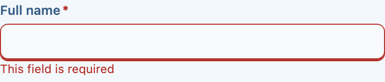

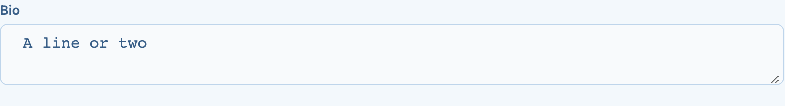

```ts
{ name: "email", kind: "email", label: "Email", validators: { required: true } }
```

`email` and `password` are `text` with the right input type and semantics — same anatomy, same
states.

### Numbers

`number`, `slider`

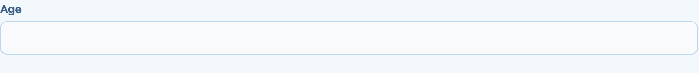

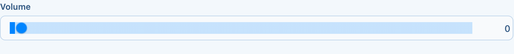

```ts
{ name: "volume", kind: "slider", label: "Volume", min: 0, max: 100, step: 1 }
```

### Booleans

`checkbox`, `toggle`


### Choosing one

`radio`, `segmented`


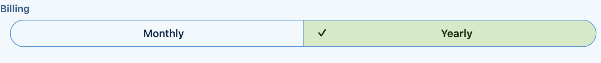

```ts
{ name: "billing", kind: "segmented", label: "Billing", options: [
  { value: "monthly", label: "Monthly" },
  { value: "yearly", label: "Yearly" },
] }
```

Both express the same choice; they differ in how much room they take and how many options stay
readable. A `segmented` control with a dozen options is a `select`.

### Choosing from a list

`select`, `multiselect`

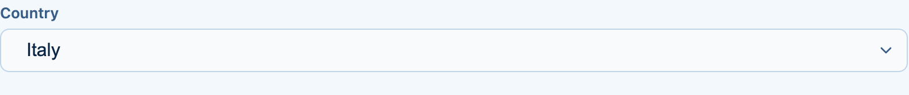

A select declares whether it filters, rather than leaving a renderer to guess — see
[ADR 0018](architecture/0018-a-select-declares-whether-it-filters.md).

The multiselect carries a quantity per option as well as membership, so a chip can be a count rather
than a flag:

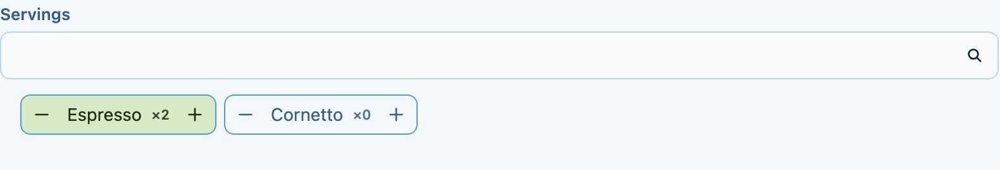

```ts
{ name: "country", kind: "select", label: "Country", searchable: true, options: [
  { value: "IT", label: "Italy" },
  { value: "FR", label: "France" },
] }
```

### Dates and times

`datepicker`, `daterange`, `timepicker`

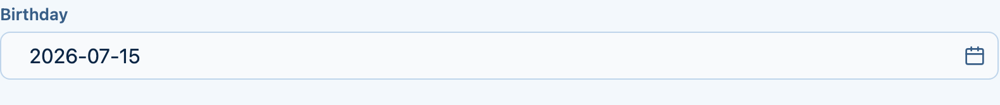


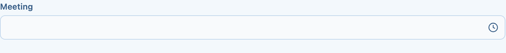

A `datepicker` stores an ISO calendar date — `"2026-07-15"` — never a `Date` and never an instant,
so nothing can convert its timezone. A `timepicker` stores `"HH:mm AM/PM"`, or `"HH:mm"` in 24-hour
mode. See [internationalization](guides/i18n.md) for parsing, locale and the first day of the week.

### Colours

`colors`

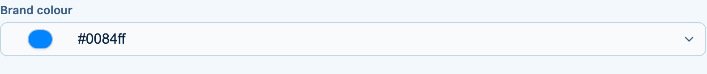

### Files

`file`

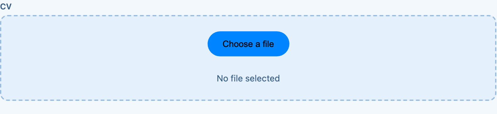

```ts
{ name: "attachment", kind: "file", label: "Attachment", multiple: true, accept: ".pdf,.png" }
```

File *contents* are never read or serialized: `mdyFormSerialize` turns a `File` into a descriptive
string.

### All of them together

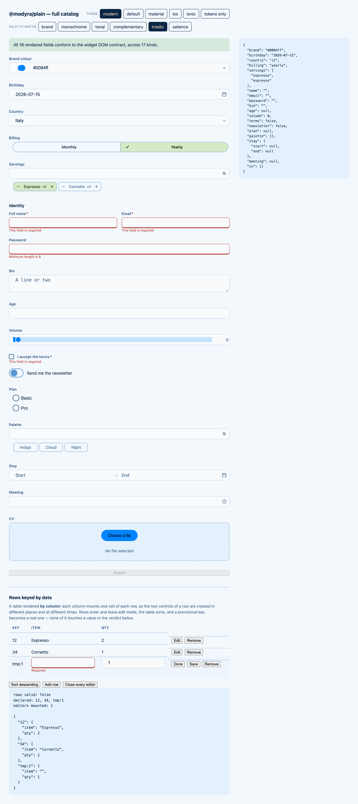

## Validation

### Synchronous

```ts
import { createForm, field, maxLength, minLength, pattern, required } from "@modyra/core";

const form = createForm({
  username: field("", [required(), minLength(3), maxLength(20)]),
  code: field("", [pattern(/^[A-Z]{2}-\d{4}$/)]),
});
```

### Asynchronous, with cancellation

```ts
import { createForm, field, serverValidator } from "@modyra/core";

const form = createForm({
  country: field("IT"),
  coupon: field("", [], serverValidator(
    async (code, ctx) => {
      const res = await api.check(code, ctx.form.fieldValue("country"), { signal: ctx.signal });
      return res.valid ? null : "Not valid for this country";
    },
    { dependsOn: ["country"], debounceMs: 400, timeoutMs: 5_000 },
  )),
});
```

A request in flight is aborted when the value or a dependency changes, so a stale response cannot
overwrite a newer one. `pending()` covers the debounce window *and* the run.

### Across fields

```ts
import { crossField } from "@modyra/core";

createForm(schema, {
  validators: [
    crossField(["password", "confirm"], (v) =>
      v.password === v.confirm ? null : "Passwords do not match"),
  ],
});
```

An empty `paths` array attributes the error to the form instead of to any field.

### From a schema

```ts
import { createZodForm } from "@modyra/zod";
import { z } from "zod";

const form = createZodForm(z.object({
  email: z.string().email(),
  age: z.number().min(18),
}));
```

Zod through `@modyra/zod`, or any Standard Schema library — Valibot, ArkType — through
`@modyra/standard-schema`. See [schema adapters](guides/schemas.md).

## Beyond validation

### Drafts

```ts
createForm(schema, {
  draft: { key: "checkout", ttlMs: 86_400_000, exclude: ["card"], version: 2 },
});
```

The in-progress value survives a refresh. Excluded fields are never written, a successful submit
clears the draft, and a `ttlMs` or `version` mismatch discards it. Storage defaults to
`localStorage` — origin-wide and plain text, so read [security](guides/security.md) before storing
anything sensitive.

### Undo and redo

History is opt-in — pass `history` when you create the form:

```ts
const form = createForm(schema, { history: true });
// or { history: { maxEntries: 100, debounceMs: 250 } }

form.mutate(() => {          // one history entry, not three
  form.f.a.set(1);
  form.f.b.set(2);
  form.f.c.set(3);
});

form.undo();       // back to where mutate() started
form.redo();
form.canUndo();    // false when there is nothing to restore
```

History restores values only — never touched, dirty or errors.

### What actually changed

```ts
form.getChanges();  // only the leaves that differ from their initial value
```

### Submission and server errors

```ts
await form.submit(async (value) => {
  const res = await api.save(value);
  return res.ok ? [] : [{ path: "email", kind: "server", message: res.error }];
});
```

Submission is gated by `canSubmit()`. Returned errors are attached to their fields and cleared as
soon as the field's value stops matching what was submitted. An error whose path matches no field
surfaces on `errorsFor("")`.

### Injection prevention

```ts
createForm(schema, {
  security: { sanitize: "text", maxValueLength: 5_000, onViolation: (v) => log(v) },
});
```

Sanitization is opt-in — the default is `"off"`. See [security](guides/security.md).

## Where to go next

- [Typed forms](guides/typed-forms.md) — the same ground in depth
- [Usage modes](guides/usage-modes.md) — typed, contract-driven or headless
- [Forms as data](guides/ai-generated-forms.md) — the same controls, declared as JSON
- [The UI toolkit](guides/ui-toolkit.md) — theming, and what a renderer owes the contract
